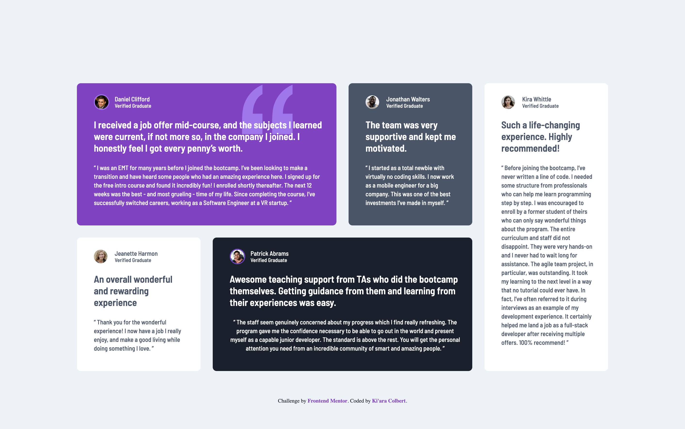

# Frontend Mentor - Testimonials grid section solution

This is a solution to the [Testimonials grid section challenge on Frontend Mentor](https://www.frontendmentor.io/challenges/testimonials-grid-section-Nnw6J7Un7). Frontend Mentor challenges help you improve your coding skills by building realistic projects. 

## Table of contents

- [Overview](#overview)
  - [The challenge](#the-challenge)
  - [Screenshot](#screenshot)
  - [Links](#links)
- [My process](#my-process)
  - [Built with](#built-with)
- [Author](#author)

## Overview

### The challenge

Users should be able to:

- View the optimal layout for the site depending on their device's screen size

### Screenshot

### Links

- Solution URL: [View on Frontend Mentor](https://www.frontendmentor.io/solutions/testimonial-grid-html-css-VYQgZKdK50)
- Live Site URL: [View via GitHub Pages](https://kiaraaa123.github.io/testimonial-grid-frontend-mentor/)

## My process

### Built with

- Semantic HTML5 markup
- CSS custom properties
- CSS Grid

## Author

- Website - [Ki'ara Colbert](https://www.kiaracolbert.com)
- LinkedIn - [@kiaramontgomery](https://www.linkedin.com/in/kiaramontgomery/)
- GitHub - [@kiaraaa123](https://github.com/kiaraaa123)
- Frontend Mentor - [@kiaraaa123](https://www.frontendmentor.io/profile/kiaraaa123)